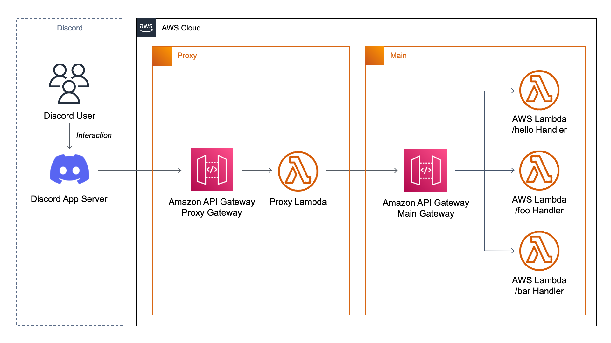

# Discord Serverless Bot with Lambda Proxy

## Introduction
Discord Serverless Bot with Lambda Proxy is an example SAM application (template or framework), that uses AWS Services - AWS API Gateway with Proxy AWS Lambda Function, in order to split functions based on event's request body.

Discord application sends all events to one endpoint URL. Our architecture prevents Discord Serverless Bot from becoming a Lambda Monolith.

## Architecture


## Run it

Prerequisites:
- AWS SAM CLI
- AWS User connected to CLI
- Discord Application created and invited to your test guild

### Clone the boilerplate and install required packages
Clone this repo with AWS SAM

```
mkdir my-serverless-discord-bot && \
cd my-serverless-discord-bot && \
sam init --location gh:jakjus/serverless-discord-bot
```

Install required packages
```
npm install
```

We are templating the main `template.yaml` file with `generate_template/generate.js`, so it's not in the main folder by default.

### Prepare
1. Get your development Guild (Discord Server) Id by enabling Developer Mode in settings and right-clicking your guild.
2. Get App Id and Bot Token from Discord Developers Portal.
3. Copy `.env.example` to `.env` and fill `.env` with real values.

### Generate template
Generate template based on your folder structure and metadata in `src/`:
```
node generate_template/generate.js
```

### Register commands
Register commands on one guild for development (instant):
```
node register_commands/register.js
```

*If you will not specify `GUILD_ID` environment variable, deployed commands will be global.*

### Build and deploy
Build and deploy with:
```
sam build && sam deploy --guided
```

## Add your own function
1. Create a new command in `src/modules/example/another-one.js` similar to `hello-from-lambda.js`. It must have another name within the `exports.data`.
2. Generate template, register commands, build and deploy using:
```
node generate_template/generate.js && \
node register_commands/register.js && \
sam build && sam deploy
```

## Clean all
```
sam destroy
```


# Sidenotes

This project contains source code and supporting files for a serverless application that you can deploy with the AWS Serverless Application Model (AWS SAM) command line interface (CLI). It includes the following files and folders:

- `src` - Code for the application's Lambda function.
- `events` - Invocation events that you can use to invoke the function.
- `__tests__` - Unit tests for the application code. 
- `template.yaml` - A template that defines the application's AWS resources.

Resources for this project are defined in the `template.yaml` file in this project. The file has its own template generator. You can update the template to add AWS resources through the same deployment process that updates your application code.

If you prefer to use an integrated development environment (IDE) to build and test your application, you can use the AWS Toolkit.  
The AWS Toolkit is an open-source plugin for popular IDEs that uses the AWS SAM CLI to build and deploy serverless applications on AWS. The AWS Toolkit also adds step-through debugging for Lambda function code. 

To get started, see the following:

* [CLion](https://docs.aws.amazon.com/toolkit-for-jetbrains/latest/userguide/welcome.html)
* [GoLand](https://docs.aws.amazon.com/toolkit-for-jetbrains/latest/userguide/welcome.html)
* [IntelliJ](https://docs.aws.amazon.com/toolkit-for-jetbrains/latest/userguide/welcome.html)
* [WebStorm](https://docs.aws.amazon.com/toolkit-for-jetbrains/latest/userguide/welcome.html)
* [Rider](https://docs.aws.amazon.com/toolkit-for-jetbrains/latest/userguide/welcome.html)
* [PhpStorm](https://docs.aws.amazon.com/toolkit-for-jetbrains/latest/userguide/welcome.html)
* [PyCharm](https://docs.aws.amazon.com/toolkit-for-jetbrains/latest/userguide/welcome.html)
* [RubyMine](https://docs.aws.amazon.com/toolkit-for-jetbrains/latest/userguide/welcome.html)
* [DataGrip](https://docs.aws.amazon.com/toolkit-for-jetbrains/latest/userguide/welcome.html)
* [VS Code](https://docs.aws.amazon.com/toolkit-for-vscode/latest/userguide/welcome.html)
* [Visual Studio](https://docs.aws.amazon.com/toolkit-for-visual-studio/latest/user-guide/welcome.html)

## Resources

For an introduction to the AWS SAM specification, the AWS SAM CLI, and serverless application concepts, see the [AWS SAM Developer Guide](https://docs.aws.amazon.com/serverless-application-model/latest/developerguide/what-is-sam.html).

Next, you can use the AWS Serverless Application Repository to deploy ready-to-use apps that go beyond Hello World samples and learn how authors developed their applications. For more information, see the [AWS Serverless Application Repository main page](https://aws.amazon.com/serverless/serverlessrepo/) and the [AWS Serverless Application Repository Developer Guide](https://docs.aws.amazon.com/serverlessrepo/latest/devguide/what-is-serverlessrepo.html).
